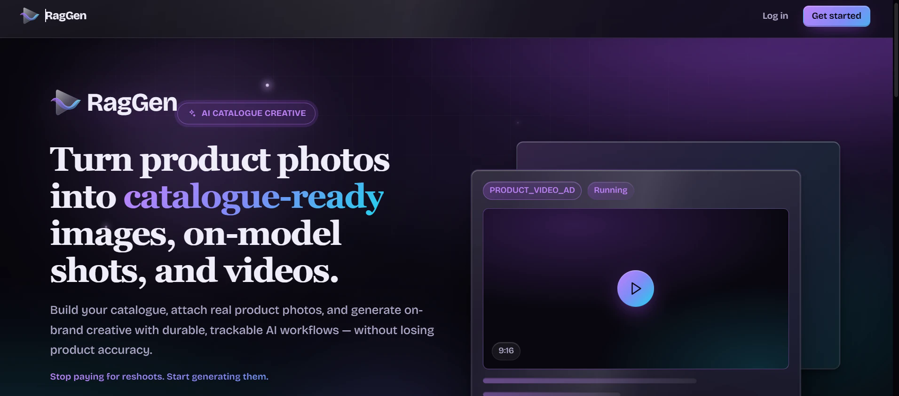

# RagGen

Turn real product photos into catalogue images, on-model shots, and short ad videos — grounded in your own brand documents by a retrieval-augmented generation engine, so the output follows your rules instead of the model's guesses.

**Live demo:** [raggen.vercel.app](https://raggen.vercel.app)



---

## Overview

RagGen is two systems in one application.

**A brand knowledge base.** You upload PDFs, decks, documents, or images describing a brand. RagGen extracts the text (with OCR for scans), chunks and embeds it locally, and indexes it for hybrid keyword-plus-vector search. Nothing becomes retrievable until a human approves it.

**A generation studio.** You add a product, attach photos, and describe the ad you want. A multi-step pipeline plans the prompt, prepares the frames, renders, runs quality checks, and stores the result — tracked step by step as a durable job with credits, retries, and full history.

The two meet at prompt construction: every generation retrieves the brand passages relevant to that specific brief and product, and snapshots exactly which document, chunk, and excerpt it used. Any past generation can be audited back to its sources.

The application runs entirely on one machine with no paid API calls, or against real cloud storage and AI providers, with no code changes between the two.

---

## How it works

### Retrieval

Brand retrieval is a single SQL query that filters before it ranks. Eligibility — workspace, brand, approved status, expiry, campaign, provider and model scope, workflow compatibility — is applied in the query, so ranking only ever sees passages the request is actually allowed to use.

Ranking then combines two independent signals:

1. **Keyword** — PostgreSQL full-text search (`websearch_to_tsquery` + `ts_rank_cd`), top 40 matches.
2. **Semantic** — pgvector cosine similarity against 384-dimensional embeddings, top 40 matches above a 0.35 floor.

The two ranked lists are fused by reciprocal rank rather than by adding raw scores, which are not comparable across the two systems. Final selection caps context at five passages, at most two per document, within a 6,000-character budget — enforcing source diversity instead of letting one document dominate.

If no semantic index exists yet, or embedding fails, the response degrades to keyword-only and says so, rather than silently returning worse results.

### Generation pipeline

Generation is a stateless polling state machine. Each call advances one job by exactly one transition and persists it, so progress survives restarts and serverless invocations:

```
validate → [model_gen | pair | tryon] → prompt → model_prep → render → poll → qa → [composite] → store
```

Jobs are claimed with a stale-lock lease so concurrent ticks cannot double-run one, every step is idempotent and keyed off a persisted stage cursor, and a failed job refunds its reserved credits exactly once.

### Cost control

Every provider call is metered against a workspace ledger. A transactional reservation is taken *before* the call, using operator-entered prices stored as immutable versions; the real token usage and cost are recorded after. Calls with no configured price are blocked when a monthly cap is set, and a request that fails ambiguously keeps its reservation, because a timeout can still be billed.

Prompt results, image analyses, and query embeddings are cached on exact content keys — including the actual image bytes for vision calls, not just the URL.

---

## Features

**Brand knowledge and RAG**
- PDF, DOCX, PPTX, TXT, Markdown, JSON, images, or a ZIP kit (up to 50 files / 30 MB)
- Local OCR for scanned documents; paid AI captioning for images is opt-in
- Hybrid retrieval over PostgreSQL full-text search and local 384-dimensional embeddings
- Per-document scoping by campaign, expiry date, and provider/model version
- Draft → approved → archived lifecycle with content-hash deduplication and immutable versions

**Product catalog and studio**
- Multi-photo product catalog; the first photo becomes the start frame
- Product Video Ad and Product-on-Model Ad service types
- Model options: AI-generated model, your own uploaded poses, or no model
- Prompt-plan preview before any credits are spent
- Resumable job pipeline with per-step status and retries

**Accounts and isolation**
- Email and password sign-up, scrypt-hashed server-side
- Hashed session tokens in HttpOnly cookies, with an origin allowlist
- OWNER and EDITOR roles; workspaces can route to separate databases

**Measurement**
- Per-model pricing and a monthly spend cap
- Token and cost metering on every call, including cache reads and writes
- A 72-sample evaluation harness (24 briefs × no-context / keyword / hybrid) with blind scoring

**Local-first**
- Runs with no AWS account — local-disk storage serves uploads and generated media
- Mock mode renders a real slow-zoom video from your product photo via ffmpeg, so the full pipeline is demonstrable at zero cost
- Swap in real S3, Anthropic, OpenAI, and Kling credentials through `.env` alone

---

## Tech stack

| Layer | Choice |
|---|---|
| Frontend | React 19, Vite 6, React Router 7, TanStack Query 5, Zustand 5 |
| Backend | Next.js 14 (App Router, API routes) |
| Database | PostgreSQL 16 with pgvector |
| ORM | Prisma 5 |
| Auth | Email/password, scrypt hashing, hashed session cookies |
| AI providers | Anthropic, OpenAI, Kling — all optional |
| Local ML | `@huggingface/transformers` (embeddings), `tesseract.js` (OCR) |
| Storage | AWS S3, Vercel Blob, or local disk (auto-selected) |
| Media | ffmpeg for frame sampling and local mock rendering |
| Language | TypeScript, strict, across both halves |

---

## Project structure

The frontend and backend are separate codebases in one repository. The backend serves the frontend's built assets and its own API routes side by side.

```
RagGen/
├── web/                     Frontend (Vite + React SPA)
│   └── src/
│       ├── pages/           Route-level views
│       ├── components/      Shared UI
│       └── lib/             API client, auth context, query helpers
│
├── app/api/video-generator/ REST endpoints (auth, products, assets,
│                            generations, brands, RAG, session)
│
├── lib/
│   ├── video-generator/     Pipeline, providers, storage, QA
│   ├── video-generator/rag/ Ingestion, retrieval, embeddings, caching,
│   │                        usage metering, queue, evaluations
│   ├── rag-auth.ts          Password hashing, sessions, identity
│   └── tenant/              Workspace database routing
│
├── prisma/schema.prisma     Single source of truth for the schema
├── scripts/                 Operator CLIs, background worker, test suites
└── docs/                    Architecture and implementation notes
```

---

## Getting started

### Prerequisites

- Node.js 20 or later
- Docker Desktop, for the PostgreSQL/pgvector database
- Optionally an S3 bucket and Anthropic/OpenAI/Kling keys — the application runs fully without them

### Setup

```bash
git clone https://github.com/paradise2580/RagGen.git
cd RagGen
npm install
npm --prefix web install

# Create a .env file in the project root (see Configuration below).
# DB_PASSWORD is required — the application will not start without one.

npm run rag:db        # start the database container
npm run db:push       # create the schema
npm run rag:vector    # enable pgvector and indexes
npm run rag:models    # download local embedding and OCR models

npm run web:build
```

### Run

```bash
npm run dev           # application server
npm run rag:worker    # background worker, in a second terminal
```

The worker handles document extraction, indexing, and evaluation runs. It does not advance video jobs — those progress through API polling, or `npm run jobs:tick -- --watch` for unattended processing.

Open `http://127.0.0.1:3101` and create an account. In mock mode the entire flow works with no keys and no cost.

---

## Configuration

Configuration lives in a `.env` file in the project root, which is gitignored and never committed. The main variables:

| Variable | Required | Purpose |
|---|---|---|
| `DB_PASSWORD` | Yes | Local PostgreSQL password |
| `RAG_AUTH_MODE` | Yes | `required` enables real multi-user login |
| `AWS_BUCKET_NAME` | No | Leave empty to use local-disk storage |
| `ANTHROPIC_API_KEY` | No | Enables real prompt planning |
| `OPENAI_API_KEY` | No | Enables real image analysis and try-on |
| `KLING_API_KEY` | No | Enables real video rendering |
| `VIDEO_FFMPEG_PATH` | No | Enables frame QA and local mock rendering |

---

## Checks

```bash
npm run typecheck              # backend
npm --prefix web run typecheck # frontend
npm run test:rag               # RAG integration suite
npm run test:rag:extended      # OCR, embeddings, queue concurrency, budgets
npm run test:rag:isolation     # auth, roles, workspace isolation
```

The RAG suites require the database to be running and clean up the records they create.

---

## Scope and limitations

Stated plainly, because they matter more than a feature list:

- **No measured cost saving is claimed.** Adding brand context can increase token usage relative to sending none. The caching and metering exist to make cost visible and reducible; proving a saving needs a real baseline.
- **Costs are estimates** computed from operator-entered rates, not invoices. A spend cap is an application guard, not a guarantee against a provider bill.
- **Evaluation is prompt-level** and human-scored. It does not establish rendered-video quality.
- **OCR is English only**, and bounded to 20 scanned pages per document.
- **Vector search is exact**, which suits the current corpus size. Approximate indexing needs measurement before it is worth enabling.

Further detail on the architecture, retrieval design, and validation is in [`docs/`](docs/).

---

## Author

**Anshivya Nagpal** — [LinkedIn](https://www.linkedin.com/in/anshivya-nagpal-18a75b315/) · [GitHub](https://github.com/paradise2580)
