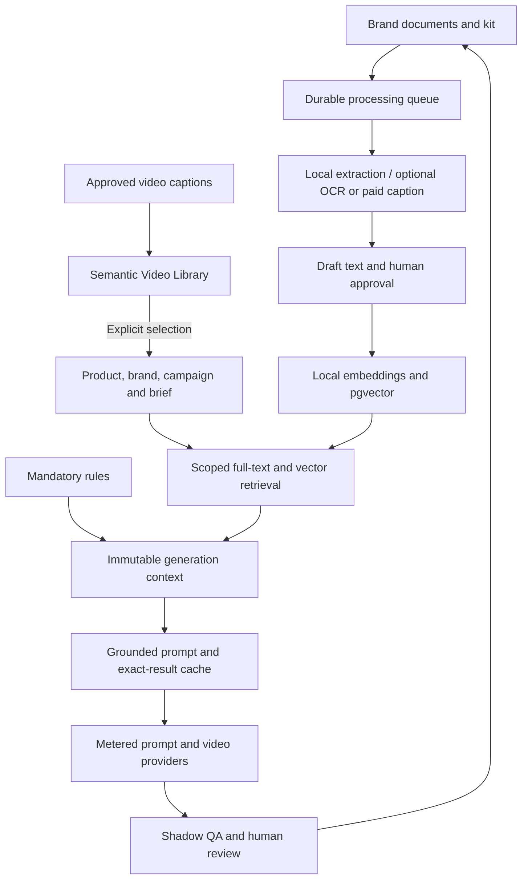

# RagGen implementation plan and delivery map

Updated 18 September 2026. All three implementation phases, plus campaign scope and local embeddings, are delivered in `C:\dev\RagGen`. The [Phase 1 plan](RAG-PHASE1-PLAN.md) is preserved as historical context. Live quality and savings measurements remain operational validation, not results established by offline tests.

## Environment

RagGen uses independent dependencies, ports 3101/5177, PostgreSQL/pgvector in container `raggen-db` on 5441, and local files in `.rag-data`. New media uses workspace namespaces.

## Delivered phases

| Phase | Delivered scope | Validation |
| --- | --- | --- |
| 1: brand grounding | Profiles/rules, document review/approval/archive, bounded retrieval, exact product facts, immutable prompt snapshots, exact successful prompt caching | Core and HTTP tests |
| 2: reuse and measurement | Byte-based vision/caption caches, static prefix caching, ratings, approved examples, QA lessons, ffmpeg/shadow QA configuration, usage ledger, versioned prices, budget reservations, blind evaluations, model routing and durable worker | Extended tests, workflow tests, QA harness |
| 3: discovery and isolation | Separate pgvector deployment, full-text/vector fusion, provider/version scope, caption search/reuse, PPTX/ZIP/OCR, accounts and isolated workspace databases | Real local OCR/vectors, session and database isolation, builds |
| Shared additions | Campaign scope/expiry and local CPU embeddings | Scope tests and actual model inference |

## Architecture

## Implementation contracts

1. **Ingestion:** PDF/DOCX/PPTX/TXT/Markdown/JSON, image kits and ZIPs. English OCR is local opt-in; image captioning is a separate paid opt-in. Originals use generated filenames outside public paths. Parsing never follows document links or executes content.
2. **Limits:** 10 MB input, 160,000 extracted characters, 150 text PDF pages or 20 OCR pages, 50 ZIP entries/30 MB expanded, 1,000 documents per brand. Reject unsafe paths, nested archives and unsupported types. Parsers have subprocess resource limits.
3. **Lifecycle:** hash-deduplicate uploads, start DRAFT, require approval, support archive and immutable versions. Keep historical generation snapshots. Original download routes require workspace and brand access.
4. **Queue:** persisted payload/status/progress/attempts/leases; atomic claims, heartbeats, expired-lease recovery, three attempts with bounded backoff. Permanent errors remain visible. Successful staging copies are removed; originals are retained.
5. **Retrieval:** filter tenant/brand/approval/campaign/expiry/provider/model/workflow before ranking. Approved examples retain a human approving review. Combine English PostgreSQL full-text and same-model pgvector cosine candidate ranks using reciprocal-rank fusion.
6. **Context:** limit retrieved passages to 6,000 characters with document diversity. Load bounded mandatory rules and exact selected-product facts directly. Record IDs, hashes, locators, excerpts, revision and retrieval mode.
7. **Embeddings:** default local 384-dimensional MiniLM; optional configured remote embeddings. Query cache keys include workspace/model/query. Never compare incompatible model spaces. Missing indexes or failures show keyword fallback. Exact vector search is used at this corpus size; ANN tuning requires measurement.
8. **Prompts:** document text stays untrusted user-message reference data. Static fidelity constraints retain precedence. Examples and captions guide creativity, not product claims. Snapshot context and model before credit debit.
9. **Caches:** exact complete-prompt/model/mode/version keys; valid successful outputs only. Vision keys use actual image bytes plus model/analysis version/instructions, and the same bytes go to the provider. Downloads have HTTPS/DNS/size/time controls. Kit captions also use byte hashes. Concurrent identical calls share work within a process.
10. **Prefix reuse:** optional Anthropic cache hint on static instructions; record real cache read/write usage. Provider thresholds determine eligibility; no artificial padding.
11. **Costs:** workspace usage context meters prompt, images/vision, embeddings, QA and video task creation. Each retry receives its own entry. Transactional reservations precede calls. Caps block unknown-price operations; uncertain failures retain reservations.
12. **Pricing:** immutable operator-entered versions. Show measured usage separately from estimated context tokens. Dollar calculations use configured rates, not invoices. Mixed image/tool pricing and uncertain billing require reconciliation; application reservations cannot guarantee an invoice ceiling.
13. **Quality:** human fidelity/brief/brand ratings and explicit approval. Mock or incomplete generations cannot become examples. Reviewed corrections and available QA scores become lesson drafts. Historical provenance can be unknown, so review remains necessary.
14. **Evaluation:** 24 fixed briefs × no-RAG/lexical/hybrid = 72 prompt samples. Hide variants/metrics until the reviewer reveals them. Mock runs exercise workflow only; live runs require explicit selection and consume budget.
15. **Routing:** activate only completed live runs with at least 20 non-degraded truly hybrid results and mean scores >=4/5 in every dimension. New jobs snapshot the selected model. Compare candidate usage/quality against a baseline before choosing a cheaper model. Prompt ratings do not prove rendered-video quality.
16. **Discovery:** approved video captions are indexed, searched and explicitly selected into a new brief. Draft captions disappear immediately. No facial identity search.
17. **Auth:** local loopback mode or required cookie login. Scrypt password hashes, hashed random sessions, HttpOnly/SameSite cookies, expiry/revocation, bounded requests, throttling and origin checks. Workspace headers must match authenticated membership.
18. **Isolation:** separate databases isolate each workspace's products/jobs/assets and RAG records. OWNER controls prices/budgets/routing; EDITOR manages creative content. CLI provisions workspaces/memberships/internal credits. Shared hosting requires HTTPS/cookie/origin configuration.

## Data and endpoint map

| Models | Responsibility |
| --- | --- |
| RagBrand / RagDocument / RagChunk | Rules, immutable sources, lifecycle/scope and vectors |
| RagTask / RagCache | Durable processing and successful reuse |
| RagUsage / RagPrice / RagBudget | Attempt ledger, versioned rates and caps |
| RagRating / RagVideoCaption | Human review and searchable creative descriptions |
| RagEvalRun / RagEvalResult | Fixed cases, blind variants, metrics and ratings |
| RagUser / RagWorkspace / RagMembership / RagSession | Identity directory and database routing |
| Existing jobs and prompt versions | Full source snapshots, provider mode/model and usage audit |

All routes use `/api/video-generator`:

- `/brands`, `/brands/:id`, `/brands/:id/documents`, `/brands/:id/documents/:id`, `/brands/:id/retrieve`.
- `/generations` accepts brand, campaign and approved caption; `/:id/references` reads snapshots without advancing generation.
- `/rag/tasks`, `/rag/tasks/:id/retry`, `/rag/ratings/:jobId`, `/rag/lessons`.
- `/rag/captions`, `/rag/search`, `/rag/usage`, `/rag/prices`, `/rag/budget`.
- `/rag/evaluations`, `/rag/evaluations/:id`, `/:id/rate`, `/:id/activate`.
- `/auth/login`, `/auth/logout`, `/session`.

## Operational validation

[Delivery evidence](RAG-DELIVERY.md) records checks; [README](../README.md) covers startup, model preparation, accounts and backups.

Remaining validation requires real data: enter contracted prices, run and human-rate live baseline/candidate benchmarks, reconcile invoices, review actual rendered fidelity and measure corpus latency before ANN tuning. Supporting implementation is delivered. Controlled browser visual verification was unavailable.

Hard deletion/historical redaction, SSO, subscriptions and password-reset emails are outside the implementation plan.

## Shared idea backlog

Add proposals with source, benefit, required data, cost impact and a concrete acceptance test.

| Idea | Source | Status / acceptance |
| --- | --- | --- |
| Brand documents and kits | User | Delivered: approved references reach prompt snapshots |
| Reduce repeated LLM work | User | Caches/usage controls delivered; actual savings need a baseline |
| Successful prompt reuse | Assistant | Delivered: approval, provenance and workflow scope |
| Exact product grounding | Assistant | Delivered: facts stay separate from examples |
| QA-informed corrections | Assistant | Delivered: reviewed drafts carry QA context |
| Semantic Video Library | Assistant | Delivered: approved captions searched and explicitly reused |
| Campaign knowledge and expiry | Shared | Delivered: scope/expiry checked before ranking |
| Local embeddings | Shared | Delivered: CPU inference, model cache and space isolation |
| New proposal | User or assistant | Define acceptance criteria before implementation |

## References

- [pgvector](https://github.com/pgvector/pgvector)
- [Anthropic prompt caching](https://platform.claude.com/docs/en/build-with-claude/prompt-caching)
- [Transformers.js](https://huggingface.co/docs/transformers.js/index)
- [Tesseract.js](https://github.com/naptha/tesseract.js)
