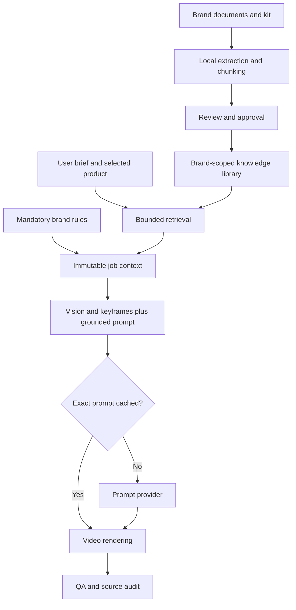

# RagGen — brand knowledge and cost-aware generation

## Objective and boundaries

Build brand grounding and cost-aware generation into RagGen at `C:\dev\RagGen`. Dependencies and build caches are disposable copies, not shared writable links. Run the API on 3101 and Vite on 5177. New uploads use the `raggen` tenant namespace.

The user can create a brand, upload its guidelines, documents and kit, review extracted knowledge, approve documents, then select that brand when generating. Only that brand's approved material is retrieved. Mandatory rules are loaded directly. Similar creative examples are suggestions, never evidence for another product's features.

## Current baseline

- React/Vite SPA, Next.js API, Prisma/PostgreSQL, S3 media storage.
- Poll-driven generation: validate → optional model preparation → vision/keyframes → Claude prompt → Kling render → optional QA/compositing → storage.
- Product facts and prompt history exist; brand knowledge, document ingestion, retrieval and evaluation datasets do not.
- The local Postgres image does not provide pgvector. Do not replace the database container to enable an initial RAG release.

## Scope and delivery phases

### Phase 1: usable local brand RAG (implementation in this copy)

1. Brand create/read/update: name, description, explicit mandatory rules, monotonically increasing knowledge revision.
2. Upload PDF, DOCX, TXT, Markdown and JSON documents; PNG/JPEG/WebP kit assets accept a human description used for retrieval. Multi-file brand kit upload is supported; ZIP archives and executable formats are rejected.
3. Enforce bounded upload size, decompressed DOCX size, extracted text length, and chunk count. Process local bytes only; do not follow document links. Scanned PDFs without text receive an actionable error; OCR is a later phase.
4. Extract locally without an LLM call. Keep original bytes outside public/ in `.rag-data`; serve downloads only through authenticated, scoped routes. Store extracted text/chunks in PostgreSQL.
5. Content-hash deduplication within a brand. New content starts DRAFT; explicit approval makes it eligible for retrieval. New versions are separate immutable documents; archive the superseded version. Every approval/archive/rule change increments the brand revision.
6. Search approved chunks with BM25-style lexical ranking, brand/approval/workflow filters and a strict context budget. This is retrieval-augmented generation without a mandatory embedding bill. Include source IDs, file names, locators and document hashes.
7. Add optional embedding-backed hybrid retrieval behind configuration. Use JSON-stored vectors plus exact cosine scoring at this dataset size. Keep embedding model identity with every vector; never compare different model spaces. Cache query vectors. If the provider is unavailable, clearly report lexical fallback. No LLM reranking in the default path.
8. At generation creation, validate the selected brand and snapshot bounded mandatory rules and retrieved context. Persist the snapshot in the job for reproducible retries. Current-job snapshots survive subsequent edits; future jobs see the new revision. Archived documents never appear in a new retrieval.
9. Augment `buildPromptMessages` after vision/keyframe selection with that snapshot and exact selected-product facts. Keep fidelity constraints authoritative and document content as untrusted reference data. Do not insert uploaded text into the system instruction hierarchy.
10. Add exact-result prompt caching keyed by full messages, model, provider mode and prompt implementation version. Cache only valid successful responses, never fallback failures. Reuse avoids the Claude call; never reuse a rendered video or charge an embedding on a lexical search.
11. Show context preview, source excerpts, character counts, approximate token counts and cache-hit information. Actual provider usage is tracked separately from estimates; never claim a dollar saving without a pricing baseline.
12. Add manual approval of historical prompt examples as knowledge documents. Completed does not mean good. Link approved examples to their original job and preserve their provenance.

### Phase 2: better reuse and measurable savings

- Enable ffmpeg and shadow QA; add human ratings for fidelity, brief adherence and brand fit. Gate examples on explicit approval; exclude mock outputs.
- Cache vision descriptions keyed by immutable image checksums, provider/model, analysis version and relevant instructions. Existing remote URLs may change content; URL-only caches are insufficient.
- Separate static system instructions from dynamic briefs. Consider Anthropic prefix caching only above supported model thresholds; measure cache creation/read tokens. Do not pad prompts just to qualify for caching.
- Establish 20–30 fixed briefs across products/brands, with no-RAG, lexical-RAG and hybrid-RAG variants. Compare blind ratings and input/output tokens before routing to a cheaper prompt model.
- Add measured per-operation usage/cost reporting and budget caps. Prices must be configurable/versioned and tied to actual usage, including retries, embeddings and image calls.
- Introduce image OCR/captioning as an explicit opt-in one-time ingestion job, with spend caps and user review. Never infer exact color specifications or trademark wording without review.
- Add a background ingestion queue, bounded concurrency, timeouts, retry/backoff, status polling and crash recovery before accepting large corpora. The local first release handles bounded uploads synchronously.

### Phase 3: scale and richer discovery

- Provision pgvector in a separate database migration environment. Migrate vectors from JSON to typed vector columns, then add indexes only after measuring corpus size and query latency. Combine PostgreSQL full-text search and vector ranking using reciprocal-rank fusion.
- Add provider/version-aware retrieval for model-specific prompt techniques. Prefer controlled internal references over live web search in paid generation.
- Add semantic Video Library search from approved captions; reuse relevant results in a new brief with explicit selection. No facial identity search.
- Extend ingestion to PPTX, ZIP kits, OCR PDFs and asset metadata after format-specific sandboxing, resource limits and tests.
- Add tenant-aware authentication and authorization before multi-user deployment. This codebase starts with a single-operator identity; a brand selector is not an authorization boundary between independent customer accounts.

## Data model

- `RagBrand`: tenantId, name, description, mandatoryRules, revision, timestamps.
- `RagDocument`: brandId, title, originalName, MIME, contentHash, storageKey, status, extractedText, sourceJobId, timestamps.
- `RagChunk`: documentId, ordinal, locator, text, optional embedding + embeddingModel; cascade on document deletion.
- `RagCache`: scope/operation, SHA-256 key, JSON value, expiresAt. Prompt entries contain valid outputs only; query-embedding entries include model identity. Key and scope prevent cross-brand reuse.
- Existing `GenerationJob.inputJson.ragContext`: immutable rules, brand ID/revision, source/chunk IDs, quoted text, retrieval mode and size estimates.
- Existing `PromptVersion.outputJson.rag`: exact references used, cache status and provider token usage. Keep this alongside the existing vision/keyframe audit.

## Request and UI contracts

- `/api/video-generator/brands`: list/create brands.
- `/brands/:id`: read/update profile and rules.
- `/brands/:id/documents`: list/upload documents or manually approved examples.
- `/brands/:id/documents/:documentId`: preview, approve/archive, authenticated download.
- `/brands/:id/retrieve`: context preview for a brief and selected product; optional refresh with embeddings.
- Generation POST gains optional `brandId`; no brand preserves the original flow.
- `/generations/:id/references`: expose immutable sources and usage from prompt audit without advancing a job.
- Brands page: create brand → edit rules → upload files → read extracted preview → approve/archive → test a brief. Explicit empty/loading/error states.
- Create page: brand picker, management link, preview retrieved context, send brandId with generation.
- Generation details: references used and cache/provider usage summary.

## Retrieval and prompt contract

1. Validate brand belongs to the fixed current tenant. Reject unknown brands before credit debit.
2. Load mandatory rules directly (bounded, never dependent on similarity).
3. Load selected product facts by primary key. They are not retrieved from other products.
4. Build query from user brief, product title/category/description and workflow. Filter to approved documents of the selected brand; prevent examples for a different workflow from becoming facts.
5. Rank lexical matches; optionally fuse cosine ranks from configured embeddings. Enforce relevance thresholds and limit duplicate adjacent passages from the same document.
6. Return at most a small number of chunks within a hard character budget. Token estimates are labeled estimates; character limits are the enforced bound.
7. If there are no relevant matches, return rules plus an explicit empty-source result. Never fabricate a reference. If storage is unavailable, surface an error before charging; do not silently discard a selected brand.
8. Treat retrieved text as data: ignore instructions to change roles, reveal secrets or override the task. Brand rules are operator-authored; document approval does not make arbitrary document instructions trusted.
9. Persist the actual context, not just mutable IDs, so retries are explainable. Context preview and generation use the same retrieval service.

## Cost model and controls

RAG is not automatically cheaper than the current short prompts. Its first benefit is grounded brand consistency. Against repeatedly pasting complete kits it reduces input volume; against no context it can increase tokens. Report the comparison honestly.

- Local extraction + lexical retrieval: zero LLM provider calls.
- Content-hash deduplication: do not reprocess identical uploads.
- Small context budgets: do not send full PDFs to the prompt provider.
- Exact prompt response cache: skip only identical successful prompt work, with a TTL and versioned key.
- Embeddings: opt-in, batch once per document; query cache keyed by model and normalized query.
- Do not skip vision, fidelity checks or keyframe constraints merely to lower cost.
- Provider usage records are actual token counts when returned. Estimated context tokens are separate. No promised percentage saving until benchmarked.

## Security, lifecycle and operational behavior

All APIs use the existing authorization gate plus brand/tenant checks. Uploaded originals stay outside the web root, use generated storage names, and are never executed or rendered as HTML. Store text only from DOCX (no external relationships), reject oversized archives, and reject encrypted/unreadable PDFs. Image-kit descriptions are manual initially. Browser previews render escaped text. Retrieval never follows a document URL.

Archive removes a document from future retrieval immediately. In-flight generations keep an auditable snapshot; a future hard-delete workflow must explicitly redact historical snapshots if privacy policy requires it. Local `.rag-data` and the database must be backed up together. Uploaded source documents should not be checked into Git. Preserve source version hashes to support audit and cache invalidation.

## Verification and release gates

- DB isolation: confirm RagGen runs against its own database and that migrations only ever target it.
- Unit tests: chunk bounds/overlap, lexical ranking, cosine/fusion, context budgeting, prompt cache keys, malicious filename handling.
- Integration tests: create two brands; upload/approve documents; prove cross-brand exclusion; duplicate upload; archive invalidation; rule updates; empty results; oversize/unsupported documents; malformed files; selected-brand validation before charging.
- Prompt tests: verify retrieved context reaches prompt messages, citations persist, cache miss/hit behavior, model/version changes invalidate caches, fallback responses never become reusable successes.
- UI verification: brand creation, upload/review/approval, preview, brand picker and generation references. Run root and frontend typechecks and frontend production build.
- No paid video generation is required for implementation tests. Use mocked provider functions and isolated test records, clean up only those records.

## Extension backlog for both collaborators

Keep additions here with: idea, source (user/assistant), expected benefit, data required, cost impact, acceptance criteria, status.

| Idea | Source | Status | Acceptance |
| --- | --- | --- | --- |
| Brand documents/guidelines/kit uploads | User | Phase 1 | Approved brand references reach prompts |
| Reduce repeated LLM work | User | Phase 1 + measurement in Phase 2 | Cache hits skip calls; compare real usage |
| Curated successful prompt reuse | Assistant | Phase 1 manual ingestion | Approval and provenance required |
| Product-document grounding | Assistant | Phase 1 | Exact product facts remain separate |
| QA-informed correction retrieval | Assistant | Phase 2 | Reviewed failures and before/after scores |
| Semantic library search | Assistant | Phase 3 | Useful retrieval evaluated with labeled queries |
| Campaign-specific knowledge and expiry | Both / future | Proposed | No expired campaign facts in new prompts |
| Local embedding model | Both / future | Proposed | Quality benchmark and predictable RAM/download use |

## References

- pgvector: https://github.com/pgvector/pgvector
- Anthropic prompt caching: https://platform.claude.com/docs/en/build-with-claude/prompt-caching
- PDF extraction: https://www.npmjs.com/package/pdf-parse
- DOCX raw text extraction: https://github.com/mwilliamson/mammoth.js

Implementation status and exact validation results are recorded separately in `docs/RAG-DELIVERY.md`; this plan intentionally includes later phases, not claims that every proposed feature already ships.
