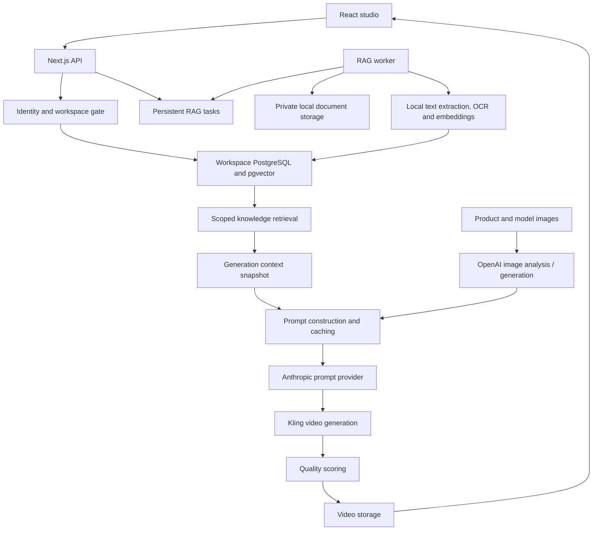

# RagGen: Project and Architecture Report

**Prepared:** 19 September 2026  
**Audience:** Developers and operators running this project  
**Project directory on the development machine:** `C:\dev\RagGen`

This is the single-file introduction and operating guide for RagGen. It covers the product, every RAG application, generation pipelines, implementation, configuration, tests and limitations. It contains no credentials. Relative source links work when this file stays at the project root.

## Contents

1. [Project summary](#1-project-summary)
2. [What RAG means here](#2-what-rag-means-here)
3. [Architecture and technology](#3-architecture-and-technology)
4. [Every place RAG is used](#4-every-place-rag-is-used)
5. [Brand document pipeline](#5-brand-document-pipeline)
6. [Retrieval algorithm and limits](#6-retrieval-algorithm-and-limits)
7. [Video generation pipelines](#7-video-generation-pipelines)
8. [Video Library retrieval](#8-video-library-retrieval)
9. [Caching and cost controls](#9-caching-and-cost-controls)
10. [Quality reviews and evaluations](#10-quality-reviews-and-evaluations)
11. [Database and storage](#11-database-and-storage)
12. [API and code map](#12-api-and-code-map)
13. [Configuration reference](#13-configuration-reference)
14. [Installation and startup](#14-installation-and-startup)
15. [Accounts and workspace isolation](#15-accounts-and-workspace-isolation)
16. [Operations and troubleshooting](#16-operations-and-troubleshooting)
17. [Validation evidence](#17-validation-evidence)
18. [Limitations and follow-up work](#18-limitations-and-follow-up-work)
19. [Glossary and supporting documents](#19-glossary-and-supporting-documents)

## 1. Project summary

RagGen turns product photographs and a written creative brief into a short generated video advertisement. A user selects a product, optionally selects or creates a human model, describes the desired video and receives a saved video in the Video Library.

The RAG additions let a user create a brand knowledge library, upload guidelines and kits, approve useful information, and reuse it across generations. The app retrieves a small amount of relevant knowledge when building the video prompt. It also supports reviewed examples, corrections, campaign-specific guidance and searchable descriptions of past videos.

The intended benefits are consistent brand instructions, explainable source references and less repeated provider work. **A measured cost reduction has not yet been established.** Adding brand context can increase tokens relative to supplying no context; savings depend on what is being replaced and how often caches are reused.

### User-facing capabilities

| Screen | Main use |
| --- | --- |
| Dashboard / Products | Find or add source products and images |
| Brand knowledge | Create brands, edit rules, upload/review/approve documents, manage scope and preview retrieval |
| Create | Select product, model mode, brand/campaign, brief and video settings |
| Generations | Follow progress, inspect prompt references and review output quality |
| Video Library | Play/download generated videos; write approved captions, search and select creative references |
| AI usage & budget | Inspect usage, enter pricing versions and set a monthly spending guard |
| RAG evaluations | Run and review fixed prompt comparisons; optionally activate an evaluated prompt model |

### Delivery status

The planned brand RAG, reuse/cost tooling, richer ingestion, pgvector search and workspace authentication features are implemented. Local integration/build tests have passed. Paid quality benchmarks, provider invoice reconciliation and visual browser testing remain separate validation work.

## 2. What RAG means here

**Retrieval-Augmented Generation** means finding relevant information from your own stored knowledge and adding it to the instructions sent to an AI model.

Example:

1. A brand uploads a guide saying: "Use warm neutral backgrounds. Keep the chest logo unchanged."
2. A user requests a premium hoodie reveal.
3. Retrieval finds the passages about apparel, lighting and logo treatment.
4. The prompt writer receives those passages alongside the brief and actual product observations.
5. The video provider receives the resulting video instructions and selected images.

Uploading a document does **not** train or fine-tune an AI model. The document becomes searchable reference material after approval.

There are two retrieval systems:

- **Brand knowledge retrieval:** searches approved document chunks and contributes context to prompt writing.
- **Video Library retrieval:** searches approved captions; a user explicitly chooses a result whose text can guide a new brief.

Several related features are separate from retrieval:

| Feature | How it works |
| --- | --- |
| Mandatory brand rules | Loaded directly for the selected brand, even if search returns no passages |
| Selected-product facts | Read from the selected product record, rather than inferred from other products |
| Prompt/vision caches | Reuse eligible earlier results rather than search documents |
| QA and human ratings | Evaluate results and support reviewed knowledge creation |
| Budgets | Guard and record provider work |
| Saved references | Display the context originally used; do not perform a new search |

## 3. Architecture and technology



If the Markdown viewer does not render Mermaid, read the flow as: **UI -> API -> workspace database/retrieval -> image preparation -> prompt writing -> video generation -> quality review -> storage.**

| Component | Implementation |
| --- | --- |
| Studio | React, TypeScript, Vite, React Router, TanStack Query |
| API / production static hosting | Next.js 14 |
| Database access | Prisma 5; generated client under `prisma/generated/tenant` |
| Database | PostgreSQL 16 with pgvector |
| Local embeddings | Transformers.js, `Xenova/all-MiniLM-L6-v2`, quantized CPU inference |
| OCR | Tesseract.js, English model |
| Document extraction | pdf-parse, mammoth, fast-xml-parser, fflate |
| Image analysis / image generation | OpenAI integrations |
| Prompt writing | Anthropic integration |
| Main video renderer | Kling integration |
| Media storage | Amazon S3 |
| Video frame sampling | ffmpeg |
| Durable RAG processing | Database-backed worker in `scripts/rag-worker.ts` |

The repository also contains a Runway adapter. The main generation pipeline currently calls Kling directly; Runway is not automatically selected.

Model IDs are configurable. Provider/model availability has not been established by a paid live benchmark, so the default model names should not be treated as a guarantee of account access.

## 4. Every place RAG is used

| Application | Knowledge used | Selection and effect |
| --- | --- | --- |
| Brand document grounding | Approved guideline/kit text | Relevant passages reach the video prompt |
| Creative examples | Prompts imported from reviewed, approved completed generations | Examples supply creative direction and retain source-job provenance |
| Reviewed corrections | Human correction notes with available QA context | Approved lesson documents can influence later prompts |
| Campaign knowledge | Documents tagged with a campaign | Included only when the request selects that campaign; expired documents are excluded |
| Provider/model guidance | Documents scoped to a provider/model version | Eligible only for matching generation settings |
| Video Library discovery | Approved captions attached to ready video assets | Search results can be explicitly selected into a new brief |
| Brand knowledge test | Same brand retrieval service | Lets the user inspect matching passages |
| Create-page preview | Brand retrieval with the selected product/workflow/campaign | Shows context before generation |
| Evaluation variants | No context, lexical context or hybrid context | Measures prompt differences under controlled briefs |
| Generation reference display | Previously saved context | Provides an audit trail; this is a read of a snapshot, not new retrieval |

The first five rows share one brand retrieval implementation. They are not separate vector databases or independent agents.

Generation without a selected brand does not retrieve brand documents. Mandatory rules apply only when their brand is selected.

## 5. Brand document pipeline

### Step-by-step

1. **Create a brand.** Enter its name, description and mandatory rules.
2. **Upload files.** The UI sends uploads for background processing.
3. **Queue the work.** The original upload is staged under a generated filename and a persistent INGEST task is created.
4. **Extract readable text.** Text documents are parsed locally. Scans can use local OCR. Kit images use a manual description, local OCR or explicitly requested paid captioning.
5. **Normalize and split the text.** Control characters are removed; passages become searchable chunks.
6. **Store a draft.** The database keeps extracted text, chunks, a content hash, original-file reference and metadata. The source file stays outside the public directory.
7. **Human review.** The user reads the extracted text and approves or archives it.
8. **Index approved content.** With the default local embedding provider, approval queues semantic indexing. Each chunk gets an embedding/model identity and a pgvector value.
9. **Retrieve during a preview or generation.** Only eligible approved passages can be selected.
10. **Maintain versions.** Upload a changed source as a new version and archive the old one. Existing job snapshots remain unchanged.

### Supported input

| Input | Extraction behavior |
| --- | --- |
| PDF with text | Local PDF text extraction |
| Scanned PDF | Optional local English OCR on pages with insufficient extracted text |
| DOCX | Raw text extraction; document formatting is not reproduced |
| PPTX | Text from ordered slide XML; a visually faithful slide interpretation is not provided |
| TXT / Markdown | UTF-8 text |
| JSON | Validated and formatted JSON text |
| PNG / JPEG / WebP | Manual description, optional OCR, or optional paid image caption |
| ZIP kit | Extract supported files under archive limits; each file becomes its own document |

Images are described as reference material. Uploading a logo does not automatically overlay that logo onto a generated video. The optional logo compositor is a separate feature.

### Limits and lifecycle rules

| Rule | Current value |
| --- | --- |
| File size | 10 MB per uploaded file |
| Extracted text | 160,000 characters per document |
| Usable text minimum | 20 characters |
| Text PDF pages | 150 |
| OCR PDF pages | 20 |
| ZIP kit | 50 entries, 30 MB expanded total, 10 MB per extracted file |
| DOCX/PPTX archive inspection | 30 MB expanded total, up to 1,500 entries |
| Brand document limit | 1,000 records; archiving retains the record |
| Parser process | 512 MB JavaScript heap setting; approximately 30 seconds normally or 180 seconds with OCR |
| Chunk target | 1,200 characters |
| Chunk overlap | 150 characters |

Documents have `DRAFT`, `APPROVED` or `ARCHIVED` status. Content/description/OCR-mode hashes deduplicate within a brand. An identical upload with different extraction options can legitimately create a different record. Parsing currently happens before document deduplication is checked, so deduplication avoids duplicate stored records/indexes but does not eliminate every repeated extraction step.

ZIP ingestion is incremental: if a later entry fails, earlier draft documents may already exist. Retrying reuses matching documents. Failed tasks retain staging files for retry; successful tasks remove their staging copy while keeping the stored originals.

**Current option interaction:** enabling paid captioning disables the OCR flag for that task in the worker. Submit scanned PDFs with OCR enabled and captioning disabled; separate mixed kits if both behaviors are needed.

## 6. Retrieval algorithm and limits

The production retrieval path is in [retrieval.ts](lib/video-generator/rag/retrieval.ts).

### Query and eligibility

The generation query combines the user's brief with selected-product facts such as title, brand, category and description.

Before ranking, the database applies:

- Correct workspace/tenant and brand.
- Document status APPROVED.
- Expiry absent or later than the current time.
- Campaign absent or exactly matching the requested campaign.
- Provider/model scope absent or matching the requested generation provider/model.
- Source-job workflow compatibility when a workflow is supplied.
- An approving human rating for documents marked EXAMPLE.

General documents with no campaign tag can still appear in campaign generations. Campaign-tagged documents are excluded when no campaign is selected. The generation path defaults provider scope to Kling and the configured Kling video model.

### Ranking

1. **Keyword search:** PostgreSQL English full-text matching using `websearch_to_tsquery` and `ts_rank_cd`.
2. **Semantic search:** embed the query and compare it with compatible stored vectors using cosine similarity.
3. **Candidates:** take up to 40 keyword matches and 40 semantic matches. Semantic similarity must be at least 0.35.
4. **Fusion:** combine rank positions rather than directly adding incomparable raw scores. Each ranked list contributes approximately `1 / (60 + rank)`.
5. **Selection:** select at most five passages, at most two per document, within a 6,000-character total passage budget.
6. **Direct context:** add the brand description and mandatory rules separately.

The full-text production path is PostgreSQL ranking. An unused BM25-style helper remains in `core.ts` and its tests; it is not the current SQL retrieval implementation.

### Embeddings

- Default local model: `Xenova/all-MiniLM-L6-v2`.
- Local vector dimension: 384.
- Local implementation: quantized CPU feature extraction, mean pooling and normalized vectors.
- Document embeddings are processed in batches of up to 32 chunks.
- Optional remote provider: OpenAI embeddings; default remote model in code is `text-embedding-3-small`, with 512 dimensions unless configured otherwise.
- Stored model keys include provider/model/dimensions.
- Query vectors are cached for one day, scoped to workspace, model identity and query.
- Exact vector scoring is used in the current query. FTS indexes are created by the vector setup script.

The vector migration script has an optional HNSW index command, but the current exact-search query is not evidence that this expression index is used. Measure query plans and adjust the query/index together before claiming ANN acceleration.

### Empty results and fallbacks

If no passages match, the selected brand's direct rules/profile can still be used. If no compatible semantic index exists, or embedding fails, the response identifies keyword fallback. A failed database/brand lookup is an error, not a reason to silently drop the selected brand.

Context token counts are estimates computed from characters, not tokenizer measurements. `approvedCorpusChars` currently totals the retrieved candidate texts, not every approved document in the brand; it must not be used as proof of whole-corpus token savings.

## 7. Video generation pipelines

### Common sequence

```text
Product images + creative brief + optional brand/campaign/reference
    -> Validate request and product
    -> Retrieve brand passages and save the context/model selection
    -> Reserve application credits and create the job
    -> Prepare images for the selected model mode
    -> Analyze visible details and choose start/end frames
    -> Build or reuse the video prompt
    -> Submit frames and instructions to Kling
    -> Poll for completion
    -> Run configured QA / optional compositing
    -> Save video to S3 and create a ready library asset
```

The brand snapshot is retrieved at job creation, before the prompt stage. It is inserted into the prompt writer's user-message data after image analysis and frame selection.

**Current integration boundary:** retrieved brand passages are supplied to the final video-prompt construction. They are not universally injected into every earlier image-generation, pose-pairing or vision call. Those steps principally use product images, model settings and the user's brief.

### Four model modes

| Mode | Preparation before the common video steps |
| --- | --- |
| NO_MODEL | Uses product photographs and selects appropriate frames |
| EXISTING_MODEL_PHOTO | Uses the uploaded model image as the video subject/start frame |
| AI_MODEL | Chooses useful angles and generates a synthetic person already wearing the product; later frames reference the first for consistency |
| PERSONALIZED_MODEL | Pairs product views with uploaded model poses, creates virtual try-on images and uses those results as candidate video frames |

The AI_MODEL path preselects/generated its frames; it avoids repeating ordinary frame selection. Personalized try-on results can reuse the garment/pose cache where applicable.

### Provider roles

- **OpenAI:** image understanding, frame/pose decisions and configured image generation.
- **Anthropic:** writes the final video prompt and negative prompt from the brief, visual observations, fidelity constraints and RAG context.
- **Kling:** animates the selected frames into the requested video.
- **S3:** stores output media and intermediate assets where required.

Static prompt instructions protect product/person fidelity. Uploaded passages are reference data in the user message. Application prompt rules reduce instruction-injection risk but do not formally guarantee model compliance or exact visual fidelity.

The pipeline records steps such as `validate`, `model_gen`, `pair`, `tryon`, `prompt`, `model_prep`, `render`, `poll`, `qa`, `composite`, `store` and `done`. Individual jobs take only the applicable branches.

### Job progression: two different workers

The **RAG worker** handles ingestion, indexing, caption indexing and evaluations. It does not advance video generation stages.

The **video pipeline** advances through API polling, including the generation detail page. For unattended local-mode processing there is a separate `jobs:tick -- --watch` script; see startup instructions below. A deployment must explicitly provide video job progression rather than assuming the RAG worker covers it.

### Output and audit

The stored result includes a playable video asset, job status/progress, prompt history and the saved source context. References contain brand/revision, document/chunk IDs, hashes, locators and quoted passages. Prompt versions record cache status and returned provider usage.

The user can then rate a result, explicitly approve it as a creative example or save a correction as a lesson draft. This is a reviewed feedback process, not automatic learning from every generation.

## 8. Video Library retrieval

The implementation is in [library.ts](lib/video-generator/rag/library.ts).

1. A user selects a generated video asset.
2. The user writes a caption describing product, motion, lighting and mood, optionally assigns a brand, and approves it.
3. CAPTION_INDEX work creates a compatible embedding.
4. Search combines English full-text and semantic candidate ranks.
5. Results are restricted to the workspace, APPROVED captions and READY assets, with an optional brand filter.
6. Up to 30 fused results are returned.
7. Selecting "Use as creative reference" passes a caption ID to Create.
8. Generation validates the approved caption and brand compatibility, then saves its text in the job.

This searches textual captions, not raw video frames, audio or faces. Captions are currently entered by the user; the paid kit-image caption feature does not automatically caption entire videos.

## 9. Caching and cost controls

### Cache layers

| Layer | Key / eligibility | Expiry or behavior |
| --- | --- | --- |
| Prompt result | Full system/user messages, workspace/brand scope, model, provider mode and RAG implementation version | Default 24 hours; configurable 0-168 hours |
| Vision description | Actual downloaded image bytes, workspace, configured describe model, mode, instructions and analysis version | Seven days; eligible successful results |
| Kit image caption | Image bytes, workspace, model and caption version | Seven days |
| Query embedding | Workspace, embedding model identity and query | One day |
| Static provider prefix | Provider-managed cache hint on static system instructions | Eligibility and retention depend on provider behavior |
| In-flight identical calls | Process-local key -> shared promise | Only while the operation runs |
| Evaluated model route | Workspace -> model and evaluation run | One year unless replaced |

Prompt caching excludes mock mode, malformed JSON and fallback responses without successful usage reporting. A cache hit saves the prompt-provider call for that step; it does not reuse the rendered video. Request coalescing is in-process, not a distributed cross-server lock.

Byte-based vision caching fetches and hashes images first, then sends those same bytes to the provider. The downloader restricts HTTPS hosts, addresses, redirects, file types, size and timeout. This avoids relying only on mutable URLs.

### Usage ledger

`usage.ts` associates provider attempts with a workspace and, when available, a generation job or RAG task. SDK wrappers meter chat, Responses and embeddings calls; prompt/video integrations and QA also use the ledger.

Each attempt follows:

```text
Find configured price
    -> Atomically check monthly usage/reservations
    -> Reserve estimated cost
    -> Call the provider
    -> Store returned usage and calculated cost
       OR retain an uncertain reservation after failure
```

Typical states are RESERVED, COMPLETE, UNPRICED and UNCERTAIN. SDK automatic retries are disabled where wrapped; application retries create separate metered attempts.

### Prices and budgets

- Prices are entered by an OWNER and stored as immutable versions.
- Match is by provider, exact model ID and operation or wildcard. The newest matching record is selected; a newer wildcard can supersede an older operation-specific entry.
- Token prices are USD per million tokens.
- One million microdollars equals USD 1.
- Video flat pricing uses rendered seconds as units.
- OpenAI cached-input accounting and Anthropic separately reported cache tokens are handled differently.
- Budget periods start at the beginning of the UTC calendar month.
- A null cap means no cap. With a cap, unpriced operations are blocked.
- Failed or ambiguous requests retain their reservation because a timeout can still incur billing.
- Application credits are separate from provider-dollar budgets.

Costs are estimates using operator-entered rates. Image/tool pricing, reservations and uncertain charges need reconciliation with actual billing. Enabling a cap does not guarantee the external provider invoice will remain under that amount. Keep `RAG_ALLOW_UNSCOPED_PROVIDERS` unset; enabling it bypasses workspace accounting for unscoped callers.

## 10. Quality reviews and evaluations

### Quality review

Generation detail reviews collect 1-5 scores for fidelity, brief adherence and brand fit, plus notes and explicit approval. Mock or incomplete jobs cannot become approved creative examples. A job whose provider provenance is unknown still needs human review before its output is reused.

A reviewed correction can become a draft LESSON document with workflow and available QA score context. It requires document approval before retrieval.

ffmpeg frame sampling supports AI fidelity scoring. The configured QA mode is shadow: scores are recorded without automatic QA rerenders/refunds. Enforced QA and optional logo compositing exist in the pipeline but require deliberate configuration. QA itself can incur vision-provider usage and upload sampled frames to S3.

### Fixed evaluation suite

The evaluation service uses six product types—hoodie, sneakers, watch, handbag, bottle and shirt—with four mood variants each. That makes 24 fixed briefs.

Each brief is run three ways:

| Variant | Context |
| --- | --- |
| none | No brand RAG context |
| lexical | Brand profile/rules and keyword-selected passages |
| hybrid | Brand profile/rules and fused keyword/semantic passages |

A complete run stores 72 prompt results. Variants and metrics are hidden in blind review unless explicitly revealed. Stored metrics include returned token usage, input characters, elapsed time, retrieval mode and mock/degraded flags. Successfully stored cases are skipped on retry.

A mock run validates plumbing and produces mock prompts. A live run requests 72 paid prompt generations; application retries may mean more than 72 provider attempts. These evaluations do not generate 72 videos.

Activating a prompt model requires:

- A completed live run.
- At least 20 rated, non-degraded results actually using hybrid retrieval.
- Mean fidelity, brief adherence and brand fit scores each at least 4/5.
- An OWNER action.

The activated model is used for future job snapshots. This is manual, quality-gated routing, not automatic selection of the cheapest model. Review costs and compare with a baseline. Prompt scores do not establish rendered-video quality, and the current no-context baseline also omits direct brand rules, so it does not isolate the contribution of retrieved passages alone.

## 11. Database and storage

The primary RagGen database also holds the identity directory. Additional workspaces are routed to separate databases using server-owned directory records. Source schema: [prisma/schema.prisma](prisma/schema.prisma).

| Model | Important contents / relationship |
| --- | --- |
| RagBrand | Tenant, name, description, mandatory rules, revision; owns documents |
| RagDocument | Brand, text, source hash/file key, status, kind, campaign, expiry, provider/model scope, optional source job |
| RagChunk | Document, ordinal, character locator, text, JSON embedding, embedding model identity, pgvector column |
| RagTask | Tenant, optional brand, task type/payload, status/progress, attempts, lease and next-run time |
| RagCache | Key, scope, JSON value, expiry; shared table for several cache purposes |
| RagPrice | Provider/model/operation, rates, version and creation time |
| RagBudget | Tenant and optional monthly microdollar limit |
| RagUsage | Tenant/job/task, provider/model/operation, reservation, calculated cost, token counts, price version and status |
| RagRating | Tenant/job/user, three scores, notes and approval |
| RagVideoCaption | Tenant/asset, optional brand/job, approved text and embeddings |
| RagEvalRun | Tenant, name, provider mode, model and run status |
| RagEvalResult | Run/case/variant, blind label, prompt, context, metrics and human scores |
| RagUser | Email, name, password hash and disabled state |
| RagWorkspace | Workspace ID/name and database name |
| RagMembership | User/workspace membership and OWNER or EDITOR role |
| RagSession | Hashed token, user and expiry |
| Existing GenerationJob / PromptVersion | Generation state, input/context/model snapshots, prompt text and output audit |
| Existing GenerationAsset | Product images, intermediate/generated images and final video references |
| Existing ProductRecord / OrganizationCredit | Catalog facts and internal application credits |

Both JSON embeddings and pgvector columns are retained. JSON supports compatibility/backfill; SQL similarity uses the vector columns.

### Physical locations

| Data | Location | Notes |
| --- | --- | --- |
| Application/database records | Docker PostgreSQL volume or configured database | Copying the source folder does not copy the database volume |
| Brand files | `.rag-data/` | Local upload storage |
| Staged failed uploads | `.rag-data/` | Retained so tasks can retry |
| Local embedding models | `.rag-data/models/` | Downloaded on first run |
| OCR model cache | `.rag-data/ocr/` | Downloaded on first run |
| Migration backups | `.rag-data/backups/` | May contain a database dump and an environment backup with secrets |
| Generated media | Configured S3 bucket | Separate from the source folder |
| Built studio | `public/video-generator/` | Regenerated by the frontend build |
| Next build | `.next/` | Regenerated on build |
| Prisma generated client | `prisma/generated/tenant/` | Regenerated during installation/setup |

## 12. API and code map

### API reference

All paths below are relative to `/api/video-generator`. APIs pass through the workspace gate. In required-auth mode, browser requests use the session cookie and `x-workspace-id`.

| Method | Path | Purpose / principal input |
| --- | --- | --- |
| GET / POST | `/brands` | List or create; name, description, mandatoryRules |
| GET / PATCH | `/brands/:brandId` | Read/update profile; send the desired full profile fields when updating |
| GET / POST | `/brands/:brandId/documents` | List; multipart upload; or JSON sourceJobId to import an example |
| GET | `/brands/:brandId/documents/:documentId` | Extracted text and metadata; `?download=1` returns original bytes |
| PATCH | `/brands/:brandId/documents/:documentId` | Change status/scope/kind; `index: true` queues indexing |
| POST | `/brands/:brandId/retrieve` | query, optional productId/campaign/workflow |
| POST | `/generations` | Existing generation inputs plus optional brandId, campaign and referenceCaptionId |
| GET | `/generations/:jobId/references` | Saved context and prompt reuse/usage |
| GET / POST | `/generations/jobs` | Advance up to 25 due jobs in the authorized workspace |
| GET | `/rag/tasks` | Recent tasks; optional brandId query |
| POST | `/rag/tasks/:id/retry` | Reset a failed task for another attempt |
| GET / POST | `/rag/ratings/:jobId` | Review/QA info; fidelity, briefAdherence, brandFit, approved, notes |
| POST | `/rag/lessons` | brandId, jobId and correction |
| GET / POST | `/rag/captions` | List/save caption; assetId, text, status and optional brandId/jobId |
| POST | `/rag/search` | query and optional brandId |
| GET | `/rag/usage` | Current-month totals, recent attempts, prices and route |
| POST | `/rag/prices` | OWNER: immutable provider/model rates and version |
| POST | `/rag/budget` | OWNER: monthlyLimitMicros, or null to remove cap |
| GET / POST | `/rag/evaluations` | List runs/cases or create run: brandId, name, model, live |
| GET | `/rag/evaluations/:id` | Blind results; `?reveal=1` includes variants/metrics |
| POST | `/rag/evaluations/:id/rate` | resultId and the three scores |
| POST | `/rag/evaluations/:id/activate` | OWNER: activate after checks |
| POST | `/auth/login` | email and password |
| POST | `/auth/logout` | Revoke cookie session |
| GET | `/session` | Current user and authorized workspaces |

Multipart document fields: `file`, optional `description`, `background=1`, `ocr=1`, `caption=1`. Background upload returns HTTP 202 with task information; it does not mean extraction or approval has completed. Some simple API uploads can still be processed synchronously.

### Principal code locations

| File / directory | Responsibility |
| --- | --- |
| [core.ts](lib/video-generator/rag/core.ts) | Limits, chunking, source selection, context types and prompt cache version |
| [documents.ts](lib/video-generator/rag/documents.ts) | Validation, extraction subprocess, local originals and deduplication |
| [rag-extract.cjs](scripts/rag-extract.cjs) | PDF/DOCX/PPTX extraction and OCR |
| [queue.ts](lib/video-generator/rag/queue.ts) | Durable claims, processing, retries and indexing/evaluation dispatch |
| [rag-worker.ts](scripts/rag-worker.ts) | Workspace worker loop |
| [embeddings.ts](lib/video-generator/rag/embeddings.ts) / [rag-embed.mjs](scripts/rag-embed.mjs) | Local/remote embedding generation |
| [retrieval.ts](lib/video-generator/rag/retrieval.ts) | Brand filters, SQL ranking, fusion, context and exact product facts |
| [vector.ts](lib/video-generator/rag/vector.ts) / [rag-vector-migrate.ts](scripts/rag-vector-migrate.ts) | Vector synchronization and database setup |
| [cache.ts](lib/video-generator/rag/cache.ts) / [vision.ts](lib/video-generator/rag/vision.ts) | Prompt/vision/caption reuse and request coalescing |
| [usage.ts](lib/video-generator/rag/usage.ts) | Metering, reservations and cost calculation |
| [library.ts](lib/video-generator/rag/library.ts) | Caption indexing/search |
| [evaluations.ts](lib/video-generator/rag/evaluations.ts) | Cases, evaluation execution and model activation |
| [pipeline.ts](lib/video-generator/pipeline.ts) | Generation stages and prompt-context integration |
| [providers.ts](lib/video-generator/providers.ts) / [qa.ts](lib/video-generator/qa.ts) | Provider adapters and fidelity checks |
| [context.ts](lib/video-generator/context.ts) / [rag-auth.ts](lib/rag-auth.ts) | API authorization, sessions and roles |
| [tenant-db.ts](lib/tenant/tenant-db.ts) | Authorized workspace database routing |
| `app/api/video-generator/brands/`, `rag/`, `auth/` | API route handlers |
| [brands.tsx](web/src/pages/brands.tsx) / [RagContext.tsx](web/src/components/RagContext.tsx) | Brand UI, context preview and source audit |
| [RagOperations.tsx](web/src/components/RagOperations.tsx) / [rag-operations.tsx](web/src/pages/rag-operations.tsx) | Tasks, reviews, captions, usage and evaluation UI |
| [rag.ts](web/src/lib/rag.ts) / [api.ts](web/src/lib/api.ts) | Browser API and upload helpers |
| [rag-workspace.ts](scripts/rag-workspace.ts) | Database/account/membership/internal-credit provisioning |

## 13. Configuration reference

Configuration lives in a `.env` file in the project root, which is gitignored. Never paste real credentials into this report. Next loads environment configuration; CLI scripts preload [db-env.cjs](scripts/db-env.cjs), which composes the database URL using [db-url.cjs](lib/db-url.cjs).

### RAG and runtime settings

| Setting | Local setup / purpose |
| --- | --- |
| DB_HOST / DB_PORT / DB_NAME | `127.0.0.1` / `5441` / `raggen` |
| DB_USER / DB_PASSWORD | PostgreSQL role and separately supplied password |
| DB_SCHEMA | Normally `public` |
| TENANT_DATABASE_URL | Optional override; ensure it targets the intended isolated database |
| VIDEO_GENERATOR_TENANT_ID | `raggen` for the local workspace |
| NEXT_PUBLIC_VIDEO_GENERATOR_ENABLED | Feature gate; `false` disables gated APIs |
| RAG_DATA_DIR | `.rag-data`; use a stable shared location if API and worker are on different processes/hosts |
| RAG_RETRIEVAL_MODE | Configured `hybrid`; `lexical` requests keyword retrieval |
| RAG_EMBEDDING_PROVIDER | `local` by default; `openai` opts into remote embedding calls |
| RAG_LOCAL_EMBEDDING_MODEL | `Xenova/all-MiniLM-L6-v2`; implementation expects 384 dimensions |
| RAG_EMBEDDING_MODEL | Remote model, default `text-embedding-3-small` |
| RAG_EMBEDDING_DIMENSIONS | Remote default 512; code bounds configuration to 256-1536 |
| RAG_PROMPT_CACHE_HOURS | Default 24, maximum 168; 0 disables persistent prompt cache use |
| RAG_PREFIX_CACHE | `1` requests Anthropic static-prefix caching |
| RAG_AUTH_MODE | `local` for one operator; `required` enables authenticated memberships |
| RAG_SECURE_COOKIES | `1` for HTTPS shared deployment |
| RAG_ALLOWED_ORIGINS | Comma-separated permitted UI origins |
| VIDEO_GENERATOR_API_TOKEN | Optional additional shared-secret gate; not a replacement for workspace sessions |
| PROVIDER_MODE | `mock`, `auto` or `live` |
| VITE_API_PROXY_TARGET | Point development UI at `http://127.0.0.1:3101` |
| VIDEO_GENERATOR_BASE_URL | Set to `http://127.0.0.1:3101` for the separate job ticker |
| TICK_INTERVAL_MS | Ticker interval, default 10,000 ms |
| VIDEO_FFMPEG_PATH | Path to ffmpeg for frame sampling |
| VIDEO_QA_MODE | Configured `shadow`; live scoring can incur provider usage |

The retrieval service falls back to lexical mode if RAG_RETRIEVAL_MODE is absent, although the prepared RagGen configuration explicitly selects hybrid. Changing retrieval to lexical does not prevent local embedding tasks from being queued when documents are approved.

### Provider and storage credentials

Live generation needs the relevant OpenAI, Anthropic and Kling credentials, model IDs and endpoints, plus configured S3 access. Main variables include:

- `OPENAI_API_KEY`, `OPENAI_DESCRIBE_MODEL`, `OPENAI_TRYON_MODEL`.
- `ANTHROPIC_API_KEY`, `ANTHROPIC_PROMPT_MODEL`.
- `KLING_API_KEY`, `KLING_API_BASE`, `KLING_VIDEO_MODEL`, `KLING_MODE`.
- `AWS_REGION`, `AWS_BUCKET_NAME`, `AWS_ACCESS_KEY_ID`, `AWS_SECRET_ACCESS_KEY`.

`mock` avoids real AI-provider generation but the ordinary application flow can still need database/storage access. `auto` may make real paid calls when keys exist. `live` enables real integrations; some provider failure paths can still return fallback outputs. Inspect job/audit results rather than assuming every successful job used every intended provider.

Restart API and worker after backend environment changes. Rebuild for build-time frontend settings.

## 14. Installation and startup

### Prerequisites

The development environment used Windows, Node **22.20.0** and npm **10.9.3**. These are observed versions, not a declared guarantee for every other runtime. Use the checked-in lockfiles.

You need Docker Desktop or a compatible PostgreSQL/pgvector service, writable local storage, and network access for dependency/model installation. ffmpeg enables video QA. Python/OpenCV are relevant only if configuring the optional logo compositor.

### Fresh machine

Run from the transferred RagGen root. Do not copy dependencies or a built `.next` from another platform and assume they are portable.

```powershell
# Create .env in the project root if it does not already exist, then set an independent DB password and required configuration.

npm ci
npm --prefix web ci
npm run rag:db
npm run db:push
npm run rag:vector
npm run rag:models

# Only for a fresh empty local database:
npm run db:seed

npm run build
```

`rag:db` is specifically guarded for DB_NAME=raggen and DB_PORT=5441. It starts/creates `raggen-db`, bound to loopback, using `raggen-pgvector-data`. It enables the vector extension before schema setup. For a managed database, provision the extension and connection independently.

`db:push` applies this local-release schema; use reviewed migrations/backups for an established deployment. Do not run `db:seed` casually on handed-over data: it can reset seeded credit/configuration data.

`rag:models` prepares local embeddings and English OCR. Downloads do not send brand documents to a remote embedding service. Local inference uses CPU; production capacity has not been benchmarked.

### Normal production-style local run

```powershell
npm run rag:db

# Terminal 1:
npm start

# Terminal 2, also in the RagGen root:
npm run rag:worker
```

Open **http://127.0.0.1:3101/video-generator/brands**.

### Development run

```powershell
# Terminal 1:
npm run dev

# Terminal 2:
npm run web:dev

# Terminal 3:
npm run rag:worker
```

Open **http://127.0.0.1:5177/video-generator/brands**. The frontend proxies API requests to port 3101. Run either `npm start` or `npm run dev` on 3101, not both.

Stop Next before building: development and production builds share `.next`. The production build emits the studio into `public/video-generator` and serves it through Next.

### Unattended video generation in local mode

```powershell
$env:VIDEO_GENERATOR_BASE_URL = "http://127.0.0.1:3101"
npm run jobs:tick -- --watch
```

Set that URL explicitly: the ticker's code fallback still points to port 3100, not 3101. Running the ticker may advance queued paid jobs; it is not just a health check.

**Required-auth limitation:** the existing ticker sends an optional API token but does not manage session cookies or per-workspace selection. It therefore is not a complete unattended multi-workspace scheduler under required authentication. Browser session polling works; a shared deployment needs an authenticated scheduler implementation.

### First useful demonstration

1. Create a brand named "Demo Apparel."
2. Save a mandatory rule such as "Preserve the product logo."
3. Upload a text guideline with at least 20 characters about warm backgrounds and restrained movement.
4. Wait for a draft, inspect it and approve it.
5. Wait for the indexing task to succeed.
6. Preview "A slow hoodie reveal on a warm studio backdrop."
7. Confirm the expected passage and brand rule appear.
8. Choose a real product in Create and preview references again.
9. Generate only when provider/storage settings and intended spending are ready.

Document ingestion, local indexing and reference preview can be demonstrated without a paid generation.

## 15. Accounts and workspace isolation

Local mode uses a fixed operator identity with OWNER permissions and a fixed workspace. It ignores arbitrary workspace selection as an access mechanism. Servers are configured to bind to loopback.

Required mode resolves the hashed session, checks that the user is enabled and validates membership in the requested workspace. Database names come from the server's directory, not directly from arbitrary request text.

Authentication includes scrypt password hashing, random tokens stored as SHA-256 hashes, HttpOnly/SameSite cookies, 24-hour sessions, logout revocation and per-account login throttling. Mutations check browser origins. This has automated integration coverage but is not a claim of a comprehensive security audit.

### Provisioning

```powershell
# Register the existing primary local database as a workspace, if not already registered:
npm run rag:workspace -- create raggen "RagGen"

# Create an independent empty workspace/database:
npm run rag:workspace -- create acme "Acme Studio"

# Set RAG_USER_PASSWORD through a private terminal environment mechanism first.
# New account passwords must be 12-256 characters.
npm run rag:workspace -- member acme owner@example.com OWNER

# Existing account: add another membership without resupplying its password:
npm run rag:workspace -- member raggen owner@example.com OWNER

# Explicit internal credit allocation; separate from the provider budget:
npm run rag:workspace -- credits acme 1000

# Disable an account and revoke its sessions:
npm run rag:workspace -- disable former-user@example.com
```

The create command refuses an existing workspace/database rather than overwriting or silently adopting it. Additional database names use a validated `raggen_` prefix. Provisioning needs database/extension permissions.

Before shared hosting, set RAG_AUTH_MODE=required, configure HTTPS, secure cookies and the exact permitted origins, provision accounts, and supervise the API/worker. OWNER manages price/budget/model activation. EDITOR manages brand content and generations.

The optional VIDEO_GENERATOR_API_TOKEN is an additional check even in required mode. The standard browser client does not automatically supply this server secret; setting it requires a deliberate proxy/client integration. Prefer the implemented session/membership flow for normal shared UI access.

Application database isolation does not move already-stored S3 media into per-workspace private buckets. Shared database credentials also mean database separation is an application routing boundary, not separate database credentials per workspace.

## 16. Operations and troubleshooting

### Background task behavior

RAG tasks are INGEST, INDEX, CAPTION_INDEX or EVAL. One worker processes tasks sequentially as it cycles through registered workspaces.

| Parameter | Current behavior |
| --- | --- |
| Task lease | Five minutes |
| Heartbeat | Every 20 seconds |
| Idle wait | About 1.5 seconds |
| Default attempts | Three |
| Retry delay | Exponential delay bounded at 60 seconds |
| Permanent errors | Parsing/validation and budget errors fail without automatic retries |
| Manual retry | Failed task is reset to queued with attempt counter reset |

Claims support multiple workers, but run one initially. API and worker must share document storage and the same configuration. Leases/retries are not a guarantee that every external paid side effect is exactly once; timeouts and crash recovery can require reconciliation.

Tasks are not automatically run just because the web server is running. Production operation needs a process supervisor; starting a terminal session is not a permanent deployment strategy.

### Troubleshooting table

| Symptom | First checks |
| --- | --- |
| UI unavailable | Confirm correct folder, port 3101 or 5177, and running API/UI process |
| Video Library cannot load assets | Check PostgreSQL availability, configured DB target and API/session errors |
| API reports vector type/relation missing | Run the isolated database/extension setup, schema push and vector setup in the correct order |
| Upload stays queued | Start the RAG worker; verify it can reach the directory and workspace DB |
| Task repeatedly fails | Read queue error; check format/limits, model availability, shared storage and provider budget |
| Approved document returns keyword fallback | Wait for indexing, check model identity/configuration and run rag:models if needed |
| Expected passage missing | Check brand, approval, campaign, expiry, provider/model scope, workflow and query relevance |
| Scanned PDF yields no usable text | Enable OCR without paid captioning for that task; check page limit and scan quality |
| Image kit upload rejected | Supply a meaningful description or choose OCR/captioning; inspect actual file type |
| Changed prompt ignores new document edits | Existing jobs retain snapshots; preview/create a new generation to use new knowledge |
| New workspace cannot generate | Provision product/images and internal credits; separately configure provider rates/cap |
| 401 after enabling required auth | Provision membership, sign in and verify cookie/workspace; inspect optional token gate |
| 403 on a mutation | Check allowed origin and OWNER permissions for budgets/pricing/routing |
| Budget blocks calls despite low shown spend | Check reservations, uncertain attempts, exact model price and wildcard versions |
| Video stops when browser closes | RAG worker does not tick video jobs; configure the appropriate video scheduler |
| Quality scores absent | Check ffmpeg, source/output accessibility, vision key/budget and QA configuration |
| Local model inference fails | Prepare models, check writable cache, available memory and compatible runtime |
| Production UI shows older code | Stop Next, rebuild frontend + Next, then restart the production server |

### Backup and restore

A usable backup includes the primary identity database, every workspace database, and document files. Copying the Git repository alone does not back up the data.

A local primary-database dump can be made without printing credentials:

```powershell
# Replace the role if DB_USER differs; use a unique backup filename.
docker exec raggen-db pg_dump -U video_generator -d raggen -Fc -f /tmp/raggen-backup.dump
docker cp raggen-db:/tmp/raggen-backup.dump ./raggen-backup.dump
```

Stop writers or coordinate a consistent database/files backup. Repeat for each workspace database. Restore into a new intended database, preserve directory mappings and document file keys, and test login/document retrieval/media access before switching over.

Expired caches/sessions are logically ignored but can accumulate. There is no general automatic retention service. Prune deliberately, retain originals/snapshots according to the owner's policy and inspect failed staging files before cleanup.

## 17. Validation evidence

The following results were recorded during implementation on **18 September 2026**. They are historical evidence, not claims that tests were rerun solely to write this report.

| Check | Recorded result |
| --- | --- |
| Root TypeScript | Passed |
| Frontend TypeScript | Passed |
| Frontend + Next production build | Passed; type checking enabled |
| test:rag | 18 checks: extraction, bounds, isolation, workflow filters, snapshots, caching and mock pipeline |
| test:rag:extended | 13 checks: real image OCR, PPTX/ZIP, queue/lease concurrency, actual local vectors, scopes, budgets, auth, prefix stability and all 72 mock evaluation samples |
| test:rag:http | 12 real HTTP checks through Vite/API |
| test:rag:workflow | 8 HTTP checks for queued indexing, hybrid retrieval, captions, approval, lessons, blind evaluations and usage |
| test:rag:isolation | Temporary workspace DB, cookie login/logout, membership/role/origin checks and product/brand isolation |
| test:qa | 52 mocked QA/compositing assertions |
| rag:db / rag:models | Database startup and real local model preparation passed |
| Runtime checks | Studio/API HTTP 200 responses and successful database connection |

No paid generation or paid embedding benchmark was performed by these RAG tests. Visual browser interaction was not verified because no controlled browser was available. Build logs skip linting; a passing build is not a completed lint/security audit.

To reproduce checks in an isolated RagGen test environment:

```powershell
npm run typecheck
npm --prefix web run typecheck
npm run test:rag
npm run test:rag:extended
npm run test:rag:isolation
npm run test:qa

# API 3101 and Vite 5177 must be running.
# Pause the RAG worker to avoid competing for test tasks.
npm run test:rag:http
npm run test:rag:workflow

# Stop Next before rebuilding:
npm run build
```

Tests guard the primary database name as raggen and clean up their own records. The isolation test creates/drops a uniquely named temporary test database. Use a dedicated test deployment for future CI or important customer data. The paid `qa:probe` command is not part of this offline verification set.

## 18. Limitations and follow-up work

### Important current boundaries

- Brand RAG augments final video prompt writing; it does not condition every earlier image-generation call.
- Prompt instructions do not guarantee exact logos, typography, anatomy or visual brand compliance.
- OCR is English and bounded. PPTX extraction primarily reads text; complex layouts/graphics require human descriptions or separate image processing.
- The local model is configured for 384 dimensions. Switching embedding spaces requires reindexing; dimensions alone do not make different models compatible.
- Exact vector ranking, local model subprocess startup and monthly usage scans have not been load-tested for a large deployment.
- Queue claims are durable; external provider effects are not universally exactly-once.
- Kit extraction can be partial before a failure. Document limits are application checks, not a globally serialized quota across all workers.
- Price calculations depend on complete, correct operator-entered rates. No actual savings percentage or invoice ceiling is established.
- Evaluation is prompt-level and manually scored. It is not a rendered-video benchmark or automated cheapest-model selection.
- RAG worker and video job progression are separate. Required-auth unattended scheduling needs additional integration.
- Live provider/model access and real fidelity QA remain to be validated with production accounts.
- Hard deletion with historical snapshot redaction, public self-registration, SSO and password-reset email are not included.
- Some older comments/docs still describe single-user assumptions or earlier pipeline behavior. Use executable code and this dated report rather than those stale comments.

### Suggested next steps

| Work | Reason | Acceptance evidence |
| --- | --- | --- |
| Run a live baseline/candidate study | Establish useful retrieval and any savings | Human ratings, matched briefs, actual attempt/token/cost records |
| Measure rendered-video quality | Prompt scores alone are insufficient | Reviewed videos with fidelity/brand rubric |
| Condition image preparation on approved brand context where appropriate | Brand styling may need to affect synthetic/try-on frames too | Tests proving scoped context reaches intended image calls |
| Add an authenticated per-workspace video scheduler | Finish jobs without browser polling under required auth | Unattended multi-workspace completion and isolation tests |
| Add automated browser tests | Validate forms, routing and visible error states | Repeatable upload-to-preview and generation review flows |
| Benchmark large corpora and usage ledgers | Identify latency/memory bottlenecks | Query plans and measured retrieval/queue latency |
| Add retention/redaction workflows | Support document/data lifecycle requirements | Verified originals, vectors, caches and snapshots handled consistently |
| Reconcile prices and uncertain usage | Improve spend reports | Comparison against provider invoices |
| Supervise services and centralize logs | Reliable deployment beyond local terminals | Restart/recovery drills and observable worker health |

Future ideas should record their source, benefit, data requirements, cost impact and acceptance test. The supporting implementation plan keeps a shared backlog.

## 19. Glossary and supporting documents

| Term | Meaning in this project |
| --- | --- |
| Brand | A creative knowledge collection inside a workspace |
| Workspace / tenant | Authorized account boundary with its own application database |
| Chunk | Small overlapping passage of extracted document text |
| Embedding | Numeric representation used to compare text meaning |
| pgvector | PostgreSQL extension storing/comparing embedding vectors |
| Lexical search | Matching words through PostgreSQL full-text search |
| Semantic search | Matching meaning through vector similarity |
| Hybrid retrieval | Combining lexical and semantic ranked results |
| RRF | Reciprocal-rank fusion: combine ranked positions from different searches |
| Snapshot | Saved copy of the actual context used for a generation |
| Keyframe | Starting or ending image used to guide video animation |
| Negative prompt | Instructions describing visual problems to avoid |
| Shadow QA | Record quality findings without automatically enforcing rerenders |
| Cache hit | An eligible earlier result was reused |
| Microdollar | One millionth of a US dollar |
| Lease | Temporary ownership of a queued task while a worker processes it |

Supporting documents:

- [README.md](README.md): shorter setup and usage guide.
- [RAG implementation plan](docs/RAG-IMPLEMENTATION-PLAN.md): architecture contracts and shared backlog.
- [RAG delivery evidence](docs/RAG-DELIVERY.md): implementation/testing record.
- [Historical Phase 1 plan](docs/RAG-PHASE1-PLAN.md): earlier design, superseded where this report describes later behavior.

**Maintenance rule:** update this report when changing pipeline stages, retrieval filters/limits, model configuration, storage, authentication, API contracts or startup commands. Update evidence dates only when those checks have actually been rerun.
